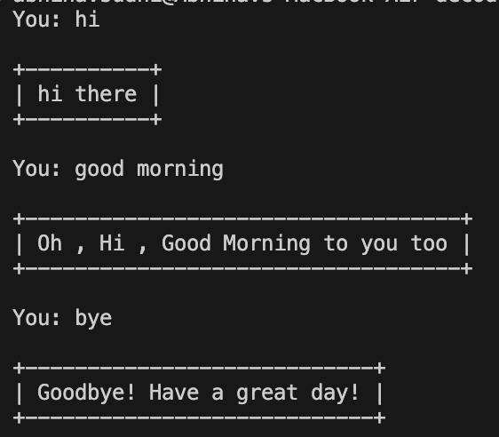

# Ashy: A Simple Rule-Based Chatbot

A lightweight, terminal-based chatbot written in Python. Ashy interacts with users by processing input triggers, matching them to a predefined dictionary vocabulary, and returning formatted responses within clean ASCII text borders.

## Table of Contents
- [Overview](#overview)
- [Algorithm](#algorithm)
- [Input Preprocessing & Formats](#input-preprocessing--formats)
- [Vocabulary & Supported Triggers](#vocabulary--supported-triggers)
- [Expected Outputs](#expected-outputs)
- [How to Run](#how-to-run)
- [Screenshots](#screenshots)

---

## Overview

The script `project1.py` implements a simple, infinite-loop conversational interface. The chatbot (named **Ashy**) matches clean versions of user inputs against a lookup table (dictionary) of responses. If a match is found, it replies with the associated response; otherwise, it outputs a generic fallback response.

---

## Algorithm

The chatbot runs on a simple rule-matching algorithm described by the following steps:

1. **Initialization**: Load the pre-defined response mapping (`vocabulary`) where keys represent cleaned user trigger phrases and values represent the corresponding responses.
2. **Infinite Loop**:
   - Prompt the user for input using `You: `.
   - **Clean and Normalise Input**:
     - Convert the entire input to lowercase.
     - Strip leading and trailing whitespace.
     - Remove all punctuation characters (`?`, `!`).
     - Remove all internal space characters (e.g., `"good morning"` becomes `"goodmorning"`).
   - **Check Exit Criteria**: If the cleaned input is one of the exit triggers (`exit`, `goodbye`, `bye`, `quit`), invoke the response formatting function and break the execution loop.
   - **Lookup Response**:
     - Search the cleaned input in the `vocabulary` dictionary.
     - If the key exists, fetch the value.
     - If the key does not exist, default to: `"I'm sorry, I didn't understand that."`
   - **Format and Print Output**:
     - Construct a box around the response using ASCII borders (`+`, `-`, `|`).
     - The width of the border is dynamically adjusted to match the length of the response message.
3. **Termination**: The loop breaks and the program exits after printing the final exit message.

---

## Input Preprocessing & Formats

To ensure robust matching, the program normalises inputs before lookup. This allows variations of the same query to succeed.

### Normalisation Examples

| Raw User Input | Normalisation Steps | Cleaned Input (Dictionary Key) |
| :--- | :--- | :--- |
| `"Hello!"` | Lowercase + remove `!` | `"hello"` |
| `"Good Morning?"` | Lowercase + remove `?` + remove spaces | `"goodmorning"` |
| `"   how are you?   "` | Strip + Lowercase + remove spaces/punctuation | `"howareyou"` |
| `"BYE!!!"` | Lowercase + remove `!` | `"bye"` |

---

## Vocabulary & Supported Triggers

The following triggers are configured in `project1.py`:

| Category | Triggers / Cleaned Keys | Chatbot Response |
| :--- | :--- | :--- |
| **Greetings** | `hi`, `hello` | `"hi there"` |
| **Time-based Greetings** | `goodmorning` | `"Oh , Hi , Good Morning to you too"` |
| | `goodafternoon` | `"Oh , Hi , Good Afternoon to you too"` |
| | `goodevening` | `"Oh , Hi , Good Evening to you too"` |
| | `goodnight` | `"Oh , Hi , Good Night to you too"` |
| **Identity & Well-being** | `howareyou` | `"I am fine , thank you"` |
| | `name` | `"I am a chatbot created by Aska , you can call me Ashy"` |
| **Gratitude** | `thanks`, `thankyou` | `"You're welcome!"` |
| **Exit Commands** | `exit`, `goodbye`, `bye`, `quit` | `"Goodbye! Have a great day!"` |

---

## Expected Outputs

All chatbot responses are displayed inside a dynamically sized ASCII frame.

### Example 1: Standard Greeting
```
You: hello
+----------+
| hi there |
+----------+
```

### Example 2: Time-based Greeting
```
You: Good Morning!
+-------------------------------------+
| Oh , Hi , Good Morning to you too   |
+-------------------------------------+
```

### Example 3: Fallback (Unrecognised Input)
```
You: what is the weather today?
+-------------------------------------+
| I'm sorry, I didn't understand that. |
+-------------------------------------+
```

### Example 4: Exit Interaction
```
You: quit
+-----------------------------+
| Goodbye! Have a great day! |
+-----------------------------+
```

---

## How to Run

Ensure you have Python 3 installed. Run the script from your terminal:

```bash
python project1.py
```

---

## Screenshots

Below is an illustration of the actual terminal interaction with the chatbot:


